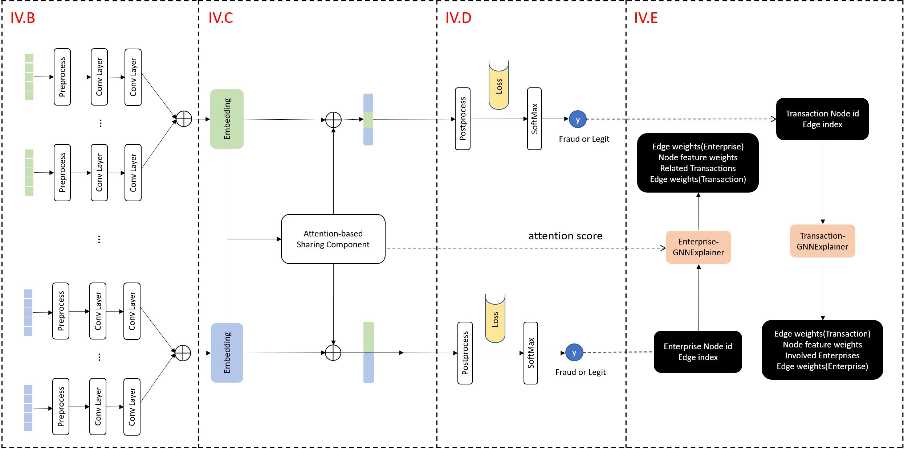

# MultiFraud
The implementation and datasets of "Heterogeneous Graph Neural Networks for Fraud Detection and Explanation in Supply Chain Finance"



## Repo Structure

The repository is organized as follows:

 - `dataset/`: dataset folder
    - `synthetic_company_1~4.mat`: Data of the synthetic company;
    - `synthetic_transaction_1~4.mat`: Data of the synthetic transaction;
    - `real_company`: Data of the real-world company;
    - `real_transaction`: Data of the real-world transaction;
- `model/`: model folder
    - `MultiFraud.ipynb`: data, model and training/testing code;
- `utils/`: functions folder
    - `synthetic_structsim.py`: generate structures for the synthetic dataset;
    - `featgen.py`: generate features for nodes in the synthetic dataset;


Detailed structure in `MultiFraud.ipynb`: 

- `Set up`: required python packages

- `Data`: Data generation and process
  - `Synthetic Data`: Synthetic data generation;
  - `Real-World Data`: Data process for real-world data;
- `Model`: Model and train/test code
  - `Parameters`: parameters of the model;
  - `Layer`: Layer definition including GraphConvLayer, MLPAttentionNetwork and BiLSTMAttentionNetwork;
  - `Model`: Model definition of MultiFraud;
  - `GNNExplainer`: [GNNExplainer](https://pytorch-geometric.readthedocs.io/en/latest/_modules/torch_geometric/nn/models/gnn_explainer.html) model from Pytorch geometric;
  - `MultiFraud: Train/Test`: Training and testing code for MultiFraud;
  - `MultiFraud-S: Train/Test`: Training and testing code for MultiFraud-S;
  - `Explainer`: explainer component to generate explainations for enterprises and transations. 


## Dataset

We build Synthetic and Real-world datasets for experiments:

|                                      | Nodes  | Fraud% | \#Features | Relation                        | \#Edges                                   |
| ------------------------------------ | ------ | ------ | ---------- | ------------------------------- | ----------------------------------------- |
| Syn. Ent. For Fraudulent Transaction | 1,050  | 22.6%  | 8          | E-E                             | 10,554                                    |
| Syn. Trx. For Fraudulent Transaction | 2,100  | 20.0%  | 8          | T-T                             | 11,804                                    |
| Syn. Ent. For Self-Financing         | 1,050  | 20.0%  | 8          | E-E                             | 9,210                                     |
| Syn. Trx. For Self-Financing         | 2,100  | 20.0%  | 8          | T-T                             | 12,152                                    |
| Syn. Ent. For Repeated Financing     | 1,050  | 24.5%  | 8          | E-E                             | 10,554                                    |
| Syn. Trx. For Repeated Financing     | 2,100  | 20.0%  | 8          | T-T                             | 12,092                                    |
| Syn. Ent. For Mixed Fraud            | 1,050  | 19.1%  | 8          | E-E                             | 10170                                     |
| Syn. Trx. For Mixed Fraud            | 2,100  | 20.0%  | 8          | T-T                             | 12,016                                    |
| Rel. Ent.                            | 13,489 | 26.4%  | 89         | E-S-E<br/>E-E<br/>E-M-E<br/>ALL | 53,874<br/>15,908<br/>139,413<br/>209,195 |
| Rel. Trx.                            | 50,000 | 1.2%   | 23         | T-A-T                           | 206,666                                   |


## How to Run

You can download the project and and run the program as follows:

1. Unzip datasets in the dataset folder `\dataset`
2.  Install the required packages using the `requirements.txt`;

```python
pip install -r requirements.txt
```

3. Run code in `MultiFraud.ipynb` to run MultiFraud. 

\* To run the code, you need to have at least **Python 3.6** or later versions.


## Run on your Datasets

To run MultiFraudon your datasets, you need to prepare the following data for enterprises and transactions separately:

- Multiple-single relation graphs with the same nodes where each graph is stored in adjacency matrix format;
- An array with node labels;
- A node feature matrix.

